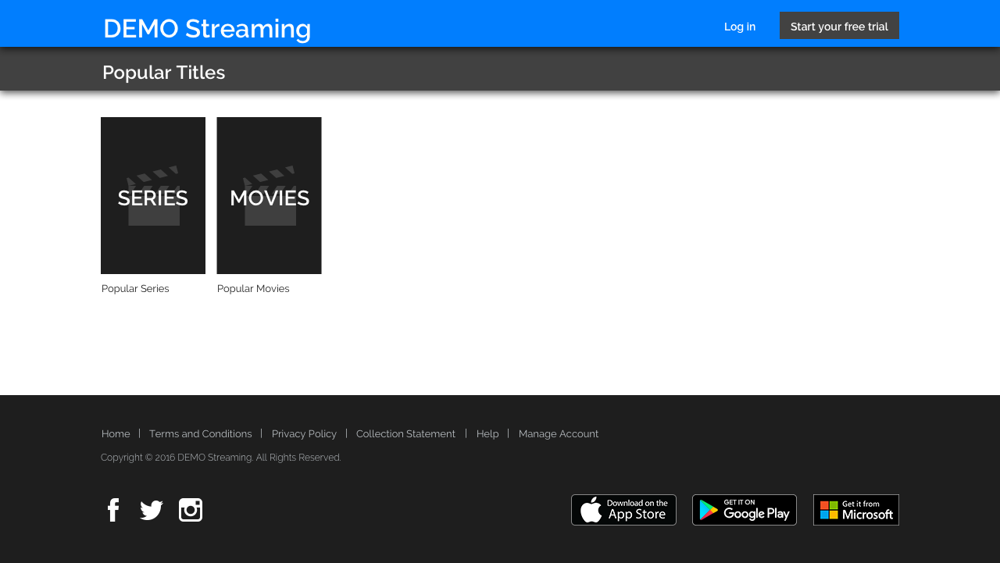
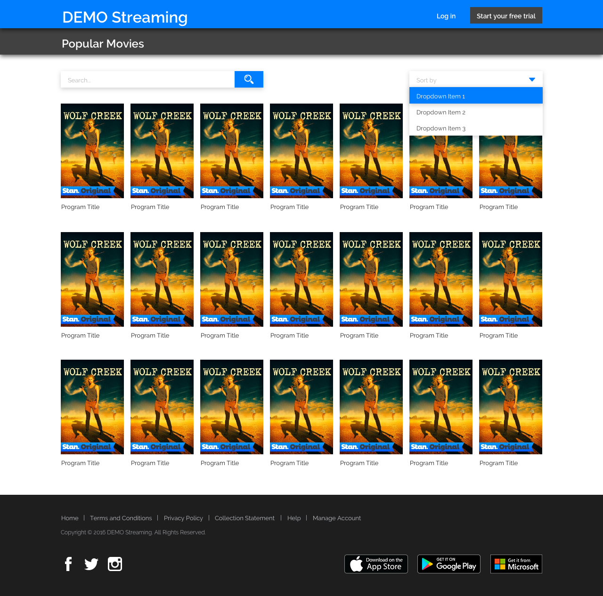

    

We are a group of researchers from various disciplines: Psychology, Linguistics, and Computer Science. Together we are developing systems and data sets to uncover media bias, or unbalanced coverage, for private or professional news consumers. We share the common vision of understanding how and why humans perceive news content as being biased, or one-sided. Within one year, our group has grown from one founder to over twenty members. You can find more about us on https://media-bias-group.com/

We care about our group culture and want to create some meaningful together. 

## About the challenge

This is a basic test, in which you should be able to write an app in a framework of your choice, using the provided screens as reference. You’ll need to get some JSON content, filter, sort and search the data and print it on view.

Although this is a basic exercise, we’ll be looking for simple, well-designed and tested code in the submission.

## Task

Using the provided screens as a reference, you’ll need to build a set of components to render the app. You’ll also need to request a JSON feed, filter that data, and use the relevant fields. 

We have provided mock movie data as a JSON file. While requesting JSON feed, we also ask you to use Redux for storing incoming data. So this stored data will be used when you build the app and the components.

Use the returned data to display a page of results that matches the given design.

Please include a README with setup instructions, and any tests or other documentation you created as part of your solution.

In case you use React, we also recommend you to use [create-react-app](https://github.com/facebook/create-react-app)  in order not to make basic configuration yourself.

You can use frameworks or packages as long as you can explain to us why you chose them.

 

## Design

  
  
 

 

We've provided a screen [designs](./design) for desktop version. You should roughly follow design measurements in sketch file.There is no need to be pixel-exact here, we get the gist :).  

There should be at least very rough responsitivity.

If you don't have licence for sketch visit their [official](https://www.sketch.com/) website to get a free trial version.

We encourage you to use latest CSS techniques(like flex-box) and responsive design approach.

 

## Details
You will need to build the following 3 pages with React:

- A “Home” page
- A “Series” page
- A “Movies” page

#### Home Page

This will be your index.html screen. You will need to display 2 tiles, which link to the “Series” page and the “Movies” page.

#### Series and Movies Pages

For each page you will need to fetch JSON feed in feed/sample.json, then:

- Display the first 21 entries.
- Where the entry has a releaseYear attribute value >= 2010.
- Sorted by the title attribute value in ascending alphanumeric order.

 For the Search function:
 - It should filter the title attribute value of movies and series
 - It should start to filter after typing 3 characters.

 For Movies and Series pages there will be a dropdown list which has options of:

- Sort by year in descending order.
- Sort by year in ascending order.
- Sort by title in descending order.
- Sort by title in ascending order.

For the “Series” page filter on:

- Where the entry has a programType attribute value of series

For the “Movies” page filter on:
- Where the entry has a programType attribute value of movie

The attributes you should use to display the entries are:

- title
- images → Poster Art → url

You will also need to handle the loading and error states, of fetching the JSON feed:

- Check the design file for loading and error screens.

Please create components for each part of the page (eg. header, content, footer, etc).

You can assume that you do not have to support legacy browsers without features such as fetch or flexbox.
 
 
## Nice to have 

These are not obligatory but big plus if you implement. Here's few suggestion of things we'd like to see:

- Implement solution in TypeScript.

- Implement solution in Next.js.

- Responsive design for mobile device.

- Showing your work through your Git commit history.

- Production grade code (clean, maintainable, reusable code)

- Implement unit tests with Jest & Enzyme or react-rest-renderer.

- Prefer to use a css methodology, such as BEM.
 

## Submission Guidelines

* Please submit your code by sending a Github repository link.
 

## Project evaluation table

We are evaluating project according to the features which specified table at the below.

First of all, candidates project should have all requirements at base table.
 

| Base requirements  |       
| --- | --- |
| HTML Markup |
| Framework implementation |
| Production grade & Best practices | 
| Project folder structure | 
 

Not necessary are the bonus features:
 

| Bonus   |           
| --- | --- |
| Typescript | 
| Next.js | 
| Git commit history| 
| Unit Tests | 
